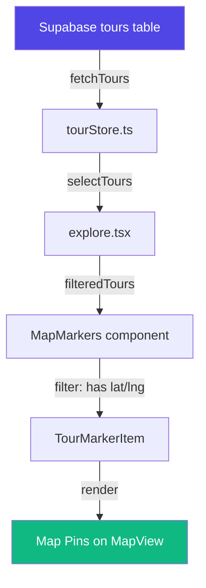

# Dynamic Map Pins Implementation Plan

Haritada tour pinlerinin dinamik olarak gösterilmesi için gerekli değişikliklerin planı.

## Mevcut Durum Analizi

### ✅ Zaten Dinamik Olan Kısımlar
1. **Tour verileri Supabase'den dinamik olarak çekiliyor** - `useTourStore` hook'u `fetchTours()` ile verileri alıyor
2. **`MapMarkers` bileşeni** - Tours dizisini alıp haritada göstermek için hazır
3. **TypeScript tipleri** - `Tour` tipi `latitude?: number` ve `longitude?: number` alanlarını içeriyor
4. **Kategori filtreleme** - Çalışıyor, `filteredTours` sadece koordinatları olan turları gösteriyor

### ❌ Eksik Olan Kısımlar
1. **Veritabanı şeması** - `tours` tablosunda `latitude` ve `longitude` kolonları yok
2. **Mevcut turların koordinatları** - Hiçbir turun koordinat bilgisi yok
3. **Seed data** - İlk migration'daki turlar koordinat içermiyor

## Proposed Changes

### Database Schema Migration

#### [NEW] [016_add_tour_coordinates.sql](file:///Users/berkay/Desktop/tour-app/supabase/migrations/016_add_tour_coordinates.sql)

Yeni migration dosyası oluşturulacak:

```sql
-- Add latitude and longitude columns to tours table
ALTER TABLE tours ADD COLUMN IF NOT EXISTS latitude DECIMAL(10, 8);
ALTER TABLE tours ADD COLUMN IF NOT EXISTS longitude DECIMAL(11, 8);

-- Create index for geospatial queries
CREATE INDEX IF NOT EXISTS idx_tours_coordinates ON tours(latitude, longitude) 
WHERE latitude IS NOT NULL AND longitude IS NOT NULL;

-- Update existing tours with KKTC coordinates
UPDATE tours SET latitude = 35.3344, longitude = 33.3182 WHERE title = 'Bellapais Manastırı';
UPDATE tours SET latitude = 35.6636, longitude = 34.5528 WHERE title = 'Altın Kum Plajı';
UPDATE tours SET latitude = 35.1853, longitude = 33.9039 WHERE title = 'Salamis Antik Kenti';
UPDATE tours SET latitude = 35.3420, longitude = 33.3228 WHERE title = 'Girne Kalesi';
UPDATE tours SET latitude = 35.3064, longitude = 33.2825 WHERE title = 'Beşparmak Dağları';
UPDATE tours SET latitude = 35.6033, longitude = 34.3833 WHERE title = 'Karpaz Eşekleri Safari';
```

Gerçek KKTC Koordinatları:
| Tur | Enlem (Latitude) | Boylam (Longitude) |
|-----|------------------|-------------------|
| Bellapais Manastırı | 35.3344 | 33.3182 |
| Altın Kum Plajı (Karpaz) | 35.6636 | 34.5528 |
| Salamis Antik Kenti | 35.1853 | 33.9039 |
| Girne Kalesi | 35.3420 | 33.3228 |
| Beşparmak Dağları (St. Hilarion) | 35.3064 | 33.2825 |
| Karpaz Eşekleri Safari | 35.6033 | 34.3833 |

---

### Frontend Changes

> [!NOTE]
> Frontend kodu zaten dinamik veriyi destekliyor. Sadece veritabanına koordinat eklemek yeterli. Ancak aşağıdaki iyileştirmeler önerilebilir:

#### [MODIFY] [MapMarkers.tsx](file:///Users/berkay/Desktop/tour-app/components/map/MapMarkers.tsx)

Mevcut marker limiti 20'dir. Performans için bu limit korunabilir veya bölgeye göre dinamik filtreleme eklenebilir (opsiyonel).

#### [MODIFY] [explore.tsx](file:///Users/berkay/Desktop/tour-app/app/(tabs)/explore.tsx)

Yeni turlar eklendiğinde harita otomatik olarak güncellenecek çünkü realtime subscription zaten mevcut (`subscribeToRealtime` fonksiyonu `tourStore.ts`'de).

---

## Data Flow Diagram



---

## Verification Plan

### Database Migration Test
1. Migration dosyasını Supabase Dashboard SQL Editor'de çalıştır
2. `tours` tablosunu kontrol et - latitude/longitude kolonları eklenmiş olmalı
3. Mevcut turların koordinatlarını doğrula

### Manual Testing (Kullanıcı ile)
1. Uygulamayı başlat: `npx expo start`
2. "Keşfet" (Explore) sekmesine git
3. Haritada 6 adet pin görünmeli
4. Her pine tıkla - ilgili tur detayları açılmalı
5. Kategori filtreleme test et - sadece seçili kategorideki pinler görünmeli

---

## Risk Analysis

> [!IMPORTANT]
> Bu değişiklik veritabanı şemasını değiştiriyor. Production ortamında uygulamadan önce backup alınmalı.

- **Breaking Change**: Yok - yeni kolonlar opsiyonel (nullable)
- **Data Migration**: Mevcut turlar güncellenecek, yeni turlar koordinatsız eklenebilir
- **Performance**: Index ekleniyor, sorun yok
