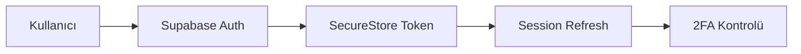

# 🔐 KKTC Tour App - Güvenlik Denetim Raporu

**Denetim Tarihi:** 4 Aralık 2025  
**Denetleyen:** Antigravity AI

---

## 📊 Genel Değerlendirme

| Kategori | Durum | Puan |
|----------|-------|------|
| **Kimlik Doğrulama** | ✅ İyi | 8/10 |
| **Yetkilendirme (RLS)** | ✅ İyi | 8/10 |
| **Input Validasyon** | ✅ Çok İyi | 9/10 |
| **API Güvenliği** | ⚠️ Dikkat Gerekli | 6/10 |
| **Hassas Veri Yönetimi** | ✅ İyi | 8/10 |
| **Rate Limiting** | ✅ Çok İyi | 9/10 |
| **İki Faktörlü Doğrulama** | ✅ Mevcut | 8/10 |

---

## ✅ Mevcut Güvenlik Önlemleri

### 1. Kimlik Doğrulama & Oturum Yönetimi



**✅ Olumlu Bulgular:**
- [expo-secure-store](file:///Users/berkay/Desktop/tour-app/lib/supabase.ts#L3) kullanılarak tokenler güvenli şekilde saklanıyor
- Auto-refresh token aktif (`autoRefreshToken: true`)
- Session persistence güvenli bir şekilde yönetiliyor
- Web platformunda `localStorage` fallback'i var

**İlgili Dosya:** [supabase.ts](file:///Users/berkay/Desktop/tour-app/lib/supabase.ts)

---

### 2. İki Faktörlü Kimlik Doğrulama (2FA)

**✅ Olumlu Bulgular:**
- Email tabanlı 6 haneli kod sistemi
- Maksimum 5 deneme hakkı
- 10 dakikalık kod geçerliliği
- Brute-force koruması

**İlgili Dosyalar:**
- [twoFactorService.ts](file:///Users/berkay/Desktop/tour-app/lib/twoFactorService.ts)
- [014_two_factor_auth.sql](file:///Users/berkay/Desktop/tour-app/supabase/migrations/014_two_factor_auth.sql)

```sql
-- Maksimum deneme kontrolü (Migration dosyasından)
IF v_record.attempts >= v_record.max_attempts THEN
    RETURN jsonb_build_object(
        'success', false,
        'error', 'max_attempts_exceeded'
    );
END IF;
```

---

### 3. Row Level Security (RLS) Politikaları

**✅ Olumlu Bulgular:**
- Tüm tablolarda RLS aktif
- Admin kontrolü için `is_admin()` helper fonksiyonu
- Kullanıcılar sadece kendi verilerini görebiliyor/düzenleyebiliyor

**RLS Kapsamı:**

| Tablo | SELECT | INSERT | UPDATE | DELETE |
|-------|--------|--------|--------|--------|
| profiles | ✅ Auth | ✅ Own | ✅ Own | - |
| tours | ✅ Public | ✅ Admin | ✅ Admin | ✅ Admin |
| favorites | ✅ Own | ✅ Own | - | ✅ Own |
| bookings | ✅ Own | ✅ Own | ✅ Own | - |
| reviews | ✅ Approved | ✅ Own | ✅ Own | - |

**İlgili Dosya:** [011_security_improvements.sql](file:///Users/berkay/Desktop/tour-app/supabase/migrations/011_security_improvements.sql)

---

### 4. Input Validasyon & Sanitizasyon

**✅ Olumlu Bulgular:**
- XSS koruması için HTML escape fonksiyonları
- SQL injection koruması için LIKE sorgu sanitizasyonu
- Güçlü şifre politikası
- Email, telefon, UUID validasyonu

**Şifre Gereksinimleri:**
- ✅ Minimum 8 karakter
- ✅ En az 1 büyük harf
- ✅ En az 1 küçük harf
- ✅ En az 1 rakam
- ✅ Maksimum 128 karakter

**İlgili Dosya:** [validation.ts](file:///Users/berkay/Desktop/tour-app/lib/validation.ts)

---

### 5. Rate Limiting

**✅ Olumlu Bulgular:**
- Token bucket algoritması kullanılıyor
- Farklı işlemler için farklı limitler

| İşlem | Limit | Süre | Block Süresi |
|-------|-------|------|--------------|
| API Genel | 100 | 1 dk | 30 sn |
| Search | 20 | 10 sn | 5 sn |
| Auth (Login) | 5 | 5 dk | 5 dk |
| Upload | 10 | 1 dk | 1 dk |
| Comment | 10 | 1 dk | 30 sn |

**İlgili Dosya:** [rateLimiter.ts](file:///Users/berkay/Desktop/tour-app/lib/rateLimiter.ts)

---

### 6. Environment Variables

**✅ Olumlu Bulgular:**
- `.env` dosyası `.gitignore`'da
- Tüm env varyantları ignore ediliyor
- `.env.example` dosyası mevcut

**`.gitignore` İçeriği:**
```
.env
.env.local
.env.development
.env.production
.env*.local
```

**İlgili Dosya:** [.gitignore](file:///Users/berkay/Desktop/tour-app/.gitignore)

---

## ⚠️ Potansiyel Riskler ve Öneriler

### 1. 🔴 API Anahtarları Client-Side'da

> [!CAUTION]
> **Kritik Risk:** OpenAI ve Anthropic API anahtarları `EXPO_PUBLIC_` prefix'i ile client-side'da kullanılıyor. Bu anahtarlar reverse engineering ile çıkarılabilir.

**Mevcut Durum:**
```typescript
// visionService.ts - Satır 274-276
const apiKey = provider === 'openai'
  ? process.env.EXPO_PUBLIC_OPENAI_API_KEY
  : process.env.EXPO_PUBLIC_ANTHROPIC_API_KEY;
```

**Önerilen Çözüm:**
```typescript
// Supabase Edge Function üzerinden proxy
const { data, error } = await supabase.functions.invoke('analyze-image', {
  body: { imageBase64, provider }
});
```

---

### 2. 🟡 Admin API Erişimi

> [!WARNING]
> **Orta Seviye Risk:** `userService.ts` dosyasında `supabase.auth.admin.getUserById()` kullanımı var. Bu fonksiyon service_role key gerektirir.

**Mevcut Durum (userService.ts - Satır 105):**
```typescript
const { data: authData } = await supabase.auth.admin.getUserById(profile.id);
```

**Önerilen Çözüm:**
- Admin işlemlerini Supabase Edge Functions'a taşıyın
- Service role key'i sadece server-side'da kullanın

---

### 3. 🟡 Error Message Exposure

> [!IMPORTANT]
> **Orta Seviye Risk:** Bazı hata mesajları detaylı bilgi veriyor.

**Örnek:**
```typescript
// authStore.ts
Alert.alert(t('auth.loginErrorTitle'), error.message);
```

**Önerilen Çözüm:**
- Kullanıcıya genel hata mesajları gösterin
- Detaylı hataları sadece loglayın

---

### 4. 🟡 Certificate Pinning Eksikliği

> [!IMPORTANT]
> **Orta Seviye Risk:** HTTPS bağlantılarında certificate pinning uygulanmamış. MITM (Man-in-the-Middle) saldırılarına açık olabilir.

**Önerilen Çözüm:**
```bash
npm install react-native-ssl-pinning
```

---

### 5. 🟢 Önerilen Ek Güvenlik Önlemleri

#### a) Biometric Authentication
```bash
expo install expo-local-authentication
```

#### b) Session Timeout
```typescript
// 15 dakika inaktivite sonrası otomatik logout
const SESSION_TIMEOUT = 15 * 60 * 1000;
```

#### c) Jailbreak/Root Detection
```bash
npm install jail-monkey
```

#### d) Screen Capture Protection (iOS)
```typescript
import { preventScreenCapture } from 'expo-screen-capture';
```

---

## 📋 Güvenlik Kontrol Listesi

### ✅ Tamamlanmış
- [x] SecureStore ile token saklama
- [x] RLS politikaları
- [x] İki faktörlü doğrulama
- [x] Input validasyonu
- [x] Rate limiting
- [x] .env gitignore
- [x] HTTPS bağlantıları
- [x] Password strength check
- [x] SQL injection koruması
- [x] XSS koruması

### ⏳ Önerilen İyileştirmeler
- [ ] API key'leri backend'e taşı
- [ ] Certificate pinning ekle
- [ ] Biometric auth ekle
- [ ] Session timeout implement et
- [ ] Error message maskeleme
- [ ] Jailbreak detection
- [ ] Screen capture protection

---

## 🛡️ Öncelikli Eylem Planı

### Acil (1-2 Hafta)
1. **Vision API key'lerini backend'e taşı** - Supabase Edge Function oluştur
2. **Error mesajlarını maskele** - Kullanıcıya genel mesajlar göster

### Kısa Vadeli (1 Ay)
3. **Certificate pinning ekle**
4. **Session timeout implement et**
5. **Rate limiting'i login denemelerine uygula** (UI'da göster)

### Orta Vadeli (3 Ay)
6. **Biometric authentication ekle**
7. **Security audit logging**
8. **Penetration test yaptır**

---

## 📚 Kaynaklar

- [OWASP Mobile Security Testing Guide](https://owasp.org/www-project-mobile-security-testing-guide/)
- [React Native Security Best Practices](https://reactnative.dev/docs/security)
- [Supabase Security Guide](https://supabase.com/docs/guides/auth/managing-user-data)
- [Expo SecureStore](https://docs.expo.dev/versions/latest/sdk/securestore/)

---

> **Not:** Bu rapor, kod tabanının statik analizi sonucunda hazırlanmıştır. Dinamik güvenlik testi (penetration test) yapılması önerilir.
