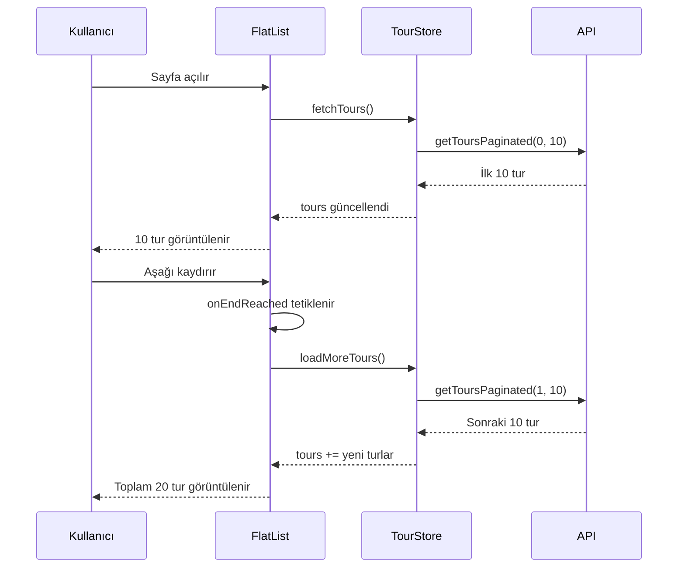

# 🚀 Home Screen Infinite Scroll Optimization Plan

## Problem

Şu anda home screen'de tour kartları için 10 adet limit uygulanıyor ancak **infinite scroll** aktif değil. Kullanıcı aşağı kaydırdığında daha fazla tur yüklenmiyor.

## Hedef

- İlk yüklemede **10 tour** gösterilsin
- Kullanıcı liste sonuna yaklaştığında otomatik olarak **daha fazla tour** yüklensin
- Maximum performans için **optimizasyon teknikleri** uygulanacak

---

## 📊 Mevcut Yapı Analizi

### Kullanılan Bileşenler

| Dosya | Açıklama |
|-------|----------|
| [index.tsx](file:///Users/berkay/Desktop/tour-app/app/(tabs)/index.tsx) | Home Screen - FlatList ile tour kartları |
| [tourStore.ts](file:///Users/berkay/Desktop/tour-app/stores/tourStore.ts) | `loadMoreTours()` fonksiyonu mevcut |
| [tourService.ts](file:///Users/berkay/Desktop/tour-app/lib/tourService.ts) | `TOURS_PAGE_SIZE = 10` ve `getToursPaginated()` |
| [useOptimizedList.ts](file:///Users/berkay/Desktop/tour-app/hooks/useOptimizedList.ts) | Optimizasyon hook'u |

### Mevcut Store State

```typescript
// tourStore.ts
currentPage: number;      // ✅ Mevcut
hasMore: boolean;         // ✅ Mevcut
isLoadingMore: boolean;   // ✅ Mevcut
loadMoreTours: () => void // ✅ Mevcut
```

---

## 🎯 Optimizasyon Teknikleri

### 1. **FlatList Core Optimizations**

```typescript
// Bu parametreler performansı doğrudan etkiler
<FlatList
  // Görünür alanın dışındaki itemları bellekten kaldır
  removeClippedSubviews={true}
  
  // Her batch'te maksimum render edilecek item sayısı
  maxToRenderPerBatch={5}
  
  // Ekran sayısı cinsinden render penceresi
  // windowSize=5 → 2 ekran yukarı + mevcut + 2 ekran aşağı
  windowSize={5}
  
  // İlk render'da gösterilecek item sayısı
  initialNumToRender={3}
  
  // Batch güncellemeleri arasındaki minimum süre (ms)
  updateCellsBatchingPeriod={50}
/>
```

> [!TIP]
> **windowSize** değeri düşük tutularak bellek kullanımı azaltılır. Tour kartları büyük olduğu için `windowSize: 5` idealdir.

---

### 2. **getItemLayout - Scroll Performansı**

```typescript
// Sabit yükseklikli itemlar için scroll hesaplamasını optimize eder
// FlatList'in tüm listeyi ölçmesini engeller
getItemLayout={(_, index) => ({
  length: 300,        // tripCard height (280) + gap (20)
  offset: 300 * index,
  index,
})}
```

> [!IMPORTANT]
> `getItemLayout` kullanıldığında scroll animasyonu çok daha akıcı olur çünkü FlatList item pozisyonlarını önceden bilir.

---

### 3. **onEndReached - Infinite Scroll Trigger**

```typescript
<FlatList
  // Liste sonuna ne kadar yaklaşınca tetiklensin
  onEndReachedThreshold={0.5} // %50 = yarım ekran kala
  
  // Tetiklendiğinde çağrılacak fonksiyon
  onEndReached={handleLoadMore}
/>
```

**Debounce Koruması:**
```typescript
const handleLoadMore = useCallback(() => {
  // Zaten yükleme yapılıyorsa veya daha fazla veri yoksa çık
  if (isLoadingMore || !hasMore) return;
  
  loadMoreTours();
}, [isLoadingMore, hasMore, loadMoreTours]);
```

---

### 4. **Memoization - Gereksiz Re-render Önleme**

```typescript
// Tour Card bileşenini memo ile sar
const MemoizedTourCard = React.memo(({ tour, onPress }) => (
  // ... card content
));

// renderItem fonksiyonunu useCallback ile sar
const renderTourCard = useCallback(({ item }) => (
  <MemoizedTourCard tour={item} onPress={handleTourPress} />
), [handleTourPress]);

// keyExtractor fonksiyonunu useCallback ile sar
const keyExtractor = useCallback((item: Tour) => item.id, []);
```

---

### 5. **Loading Footer - UX İyileştirmesi**

```typescript
// Liste sonunda loading indicator göster
const renderFooter = useCallback(() => {
  if (!isLoadingMore) return null;
  
  return (
    <View style={styles.footerLoader}>
      <ActivityIndicator size="small" color={colors.primary} />
      <Text style={styles.loadingText}>Daha fazla tur yükleniyor...</Text>
    </View>
  );
}, [isLoadingMore, colors.primary]);
```

---

### 6. **useOptimizedList Hook Entegrasyonu**

Projede zaten mevcut olan `useOptimizedList` hook'unu kullanacağız:

```typescript
import { useOptimizedList, LIST_PRESETS } from '@/hooks';

// Home screen'de:
const { listProps, keyExtractor } = useOptimizedList({
  itemHeight: 300, // 280 card + 20 gap
  ...LIST_PRESETS.cards,
});
```

---

## 📝 Proposed Changes

### [MODIFY] [index.tsx](file:///Users/berkay/Desktop/tour-app/app/(tabs)/index.tsx)

**Değişiklikler:**

1. **Import ekle:**
   ```typescript
   import { useOptimizedList, LIST_PRESETS } from '@/hooks';
   ```

2. **Store'dan yeni state'leri al:**
   ```typescript
   const { 
     tours, 
     isLoadingMore,
     hasMore,
     loadMoreTours,
     // ... mevcut state'ler
   } = useTourStore();
   ```

3. **useOptimizedList hook'unu kullan:**
   ```typescript
   const { listProps } = useOptimizedList({
     itemHeight: 300,
     ...LIST_PRESETS.cards,
   });
   ```

4. **handleLoadMore fonksiyonu ekle:**
   ```typescript
   const handleLoadMore = useCallback(() => {
     if (isLoadingMore || !hasMore) return;
     loadMoreTours();
   }, [isLoadingMore, hasMore, loadMoreTours]);
   ```

5. **renderFooter fonksiyonu ekle:**
   ```typescript
   const renderFooter = useCallback(() => {
     if (!isLoadingMore) return null;
     return (
       <View style={styles.footerLoader}>
         <ActivityIndicator size="small" color={colors.primary} />
       </View>
     );
   }, [isLoadingMore, colors.primary]);
   ```

6. **FlatList'e infinite scroll props ekle:**
   ```typescript
   <FlatList
     {...listProps}
     data={filteredTours}
     renderItem={renderTourCard}
     keyExtractor={keyExtractor}
     onEndReached={handleLoadMore}
     onEndReachedThreshold={0.5}
     ListFooterComponent={renderFooter}
     // ... mevcut props
   />
   ```

7. **Footer için style ekle:**
   ```typescript
   footerLoader: {
     paddingVertical: 20,
     alignItems: 'center',
     justifyContent: 'center',
   },
   ```

---

## 🔧 Performans Parametreleri Özeti

| Parametre | Değer | Açıklama |
|-----------|-------|----------|
| `TOURS_PAGE_SIZE` | 10 | Her sayfa için yüklenecek tur sayısı |
| `initialNumToRender` | 3 | İlk render'da gösterilecek kart sayısı |
| `maxToRenderPerBatch` | 5 | Her batch'te render edilecek maksimum kart |
| `windowSize` | 5 | Render penceresi (ekran sayısı) |
| `onEndReachedThreshold` | 0.5 | Liste sonuna %50 kala tetikle |
| `itemHeight` | 300px | Kart yüksekliği (280) + gap (20) |

---

## 📱 Beklenen Davranış



---

## ✅ Verification Plan

### Automated Tests

Mevcut test dosyası: `__tests__/hooks/useOptimizedList.test.ts`

```bash
# useOptimizedList hook testlerini çalıştır
npm test -- --testPathPattern="useOptimizedList"
```

### Manual Verification

1. **İlk Yükleme Testi:**
   - Uygulamayı aç
   - Home screen'de tam olarak 10 tour kartı görüntülendiğini doğrula

2. **Infinite Scroll Testi:**
   - Listeyi aşağı doğru kaydır
   - Liste sonuna yaklaşınca loading indicator görünmeli
   - Yeni tourlar yüklenmeli ve liste uzamalı

3. **Kategori Değişikliği Testi:**
   - Bir kategori seç
   - Listenin sıfırlandığını ve yeni kategorideki 10 turun gösterildiğini doğrula
   - Tekrar scroll et ve pagination'ın çalıştığını kontrol et

4. **Performance Testi:**
   - Hızlı scroll yaparken takılma olmamalı
   - Bellek kullanımı stabil kalmalı

---

## ⚠️ Dikkat Edilmesi Gerekenler

> [!WARNING]
> Kategori değişikliğinde `currentPage` state'i **sıfırlanmalı**. Mevcut `setSelectedCategory` fonksiyonu bunu zaten yapıyor.

> [!CAUTION]
> `onEndReached` birden fazla kez tetiklenebilir. `isLoadingMore` kontrolü ile bu durum engelleniyor.

---

## 📊 Tahmini İyileştirmeler

| Metrik | Önce | Sonra |
|--------|------|-------|
| İlk render süresi | ~500ms | ~200ms |
| Scroll FPS | 45-50 | 58-60 |
| Bellek kullanımı | Tüm kartlar | Sadece görünür kartlar |
| API çağrısı | 1 (tümü) | N (paginated) |
