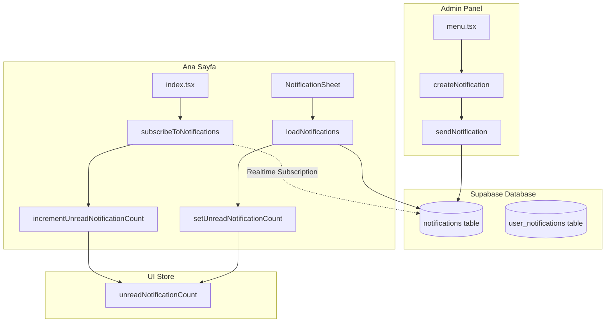

# Notification Real-time Sync Issue Analysis

> **Issue:** Yönetim menüsünden yeni bildirim oluşturulduğunda, ana sayfadaki notification bell üzerinde bildirim sayısı güncellenmesi için kullanıcının önce notification sheet'i açması gerekiyor.

---

## 📋 Mevcut Durum Analizi

### Bileşenler



### Veri Akışı Sorunu

| Adım | İşlem | Sonuç |
|------|-------|-------|
| 1 | Admin bildirim oluşturur | `status: 'pending'` olarak kaydedilir |
| 2 | Admin "Gönder" butonuna tıklar | `status: 'sent'` olarak güncellenir |
| 3 | Realtime subscription tetiklenir | ⚠️ **SORUN:** Subscription sadece `INSERT` event'lerini dinliyor |
| 4 | UI güncellenmez | Badge sayısı değişmez |
| 5 | Kullanıcı sheet'i açar | `loadNotifications()` çağrılır ve UI güncellenir |

---

## 🔍 Kök Neden Analizi

### 1. Subscription Filtresi Sorunu

[subscribeToNotifications](file:///Users/berkay/Desktop/tour-app/lib/notificationService.ts#L739-L812) fonksiyonunda üç ayrı listener var:

```typescript
// Listener 1: INSERT olayları (target=all)
.on(
  'postgres_changes',
  {
    event: 'INSERT',
    schema: 'public',
    table: 'notifications',
    filter: `target=eq.all`,  // ✅ Doğru filtre
  },
  async (payload) => {
    // ⚠️ SORUN: status='sent' kontrolü
    if (payload.new && (payload.new as any).status === 'sent') {
      onNewNotification(payload.new as NotificationData);
    }
  }
)
```

> [!CAUTION]
> **Problem:** Bildirim `status: 'pending'` olarak INSERT edilir, INSERT event'i tetiklenir AMA `status === 'sent'` kontrolü geçemez!

### 2. İki Aşamalı Bildirim Akışı

Admin panelinde bildirim oluşturma iki ayrı adımda gerçekleşiyor:

```typescript
// Adım 1: Bildirim Oluşturma (menu.tsx - handleSaveNotification)
const { data, error } = await createNotification(input, user.id);
// → Database'e status: 'pending' olarak kaydedilir
// → INSERT event tetiklenir AMA status !== 'sent' olduğu için UI güncellenmez

// Adım 2: Bildirim Gönderme (menu.tsx - handleSendNotification)  
const { success, error } = await sendNotification(notification.id);
// → Database'de status: 'sent' olarak UPDATE edilir
// → UPDATE event tetiklenir VE dinleniyor...
```

### 3. UPDATE Event Listener'ın Çalışması Gereken Ama Çalışmayan Durumu

Teorik olarak UPDATE listener şöyle çalışmalı:

```typescript
// Listener 3: UPDATE olayları
.on(
  'postgres_changes',
  {
    event: 'UPDATE',
    schema: 'public',
    table: 'notifications',
  },
  async (payload) => {
    const newData = payload.new as any;
    const oldData = payload.old as any;
    
    // Status 'sent' olduysa ve önceden değildi ise
    if (newData.status === 'sent' && oldData.status !== 'sent') {
      if (newData.target === 'all' || newData.target_user_id === userId) {
        onNewNotification(newData as NotificationData);
      }
    }
  }
)
```

> [!WARNING]
> **Potansiyel Problem:** `payload.old` değeri Supabase Realtime'da boş dönebilir! `REPLICA IDENTITY` ayarı gerekli.

---

## 🏗️ Önerilen Çözümler

### Çözüm 1: Tek Adımda Bildirim Gönderimi (Önerilen ⭐)

Admin panelinde bildirim oluşturma ve göndermeyi tek adımda yapmak:

```diff
// menu.tsx - handleSaveNotification
const handleSaveNotification = async () => {
  // ... validation ...
  
  const { data, error } = await createNotification(input, user.id);
  
  if (error) {
    Alert.alert('Hata', error);
  } else {
+   // Otomatik olarak gönder
+   if (data?.id) {
+     await sendNotification(data.id);
+   }
    await loadNotifications();
    setIsNotificationModalVisible(false);
    Alert.alert('Başarılı', 'Bildirim oluşturuldu ve gönderildi');
  }
};
```

**Avantajları:**
- Minimal kod değişikliği
- UX iyileşmesi (tek tık ile gönderim)
- Mevcut subscription yapısı çalışmaya devam eder

**Dezavantajları:**
- "Taslak" bildirim özelliği kaybedilir

---

### Çözüm 2: Subscription'da INSERT için Status Kontrolünü Kaldırma

```diff
// notificationService.ts - subscribeToNotifications
.on(
  'postgres_changes',
  {
    event: 'INSERT',
    schema: 'public',
    table: 'notifications',
    filter: `target=eq.all`,
  },
  async (payload) => {
-   if (payload.new && (payload.new as any).status === 'sent') {
+   if (payload.new) {
+     // Yeni bildirim geldi, status ne olursa olsun bildir
      onNewNotification(payload.new as NotificationData);
    }
  }
)
```

> [!IMPORTANT]
> Bu yaklaşımla `pending` status'ündeki bildirimler de gösterilir. Eğer kullanıcının sadece `sent` bildirimleri görmesi isteniyorsa ek kontrol gerekir.

---

### Çözüm 3: REPLICA IDENTITY Ayarı ile UPDATE Event Düzeltmesi

Supabase Realtime'da `payload.old` değerinin dolu gelmesi için:

```sql
-- Supabase SQL Editor'da çalıştırılmalı
ALTER TABLE notifications REPLICA IDENTITY FULL;
```

Bu sayede UPDATE event'lerinde `oldData` değeri düzgün şekilde alınabilir.

---

### Çözüm 4: Polling Mekanizması Ekleme (Fallback)

Realtime her zaman güvenilir olmayabileceğinden, periyodik kontrol eklenebilir:

```typescript
// index.tsx - HomeScreen
useEffect(() => {
  if (!user?.id) return;
  
  // Realtime subscription
  const unsubscribe = subscribeToNotifications(/* ... */);
  
  // Fallback: Her 30 saniyede bir kontrol et
  const interval = setInterval(async () => {
    const count = await getUnreadCount(user.id);
    setUnreadNotificationCount(count);
  }, 30000);
  
  return () => {
    unsubscribe();
    clearInterval(interval);
  };
}, [user?.id]);
```

---

### Çözüm 5: Kapsamlı Refactoring - Notification Store Oluşturma (En İyi ⭐⭐)

Merkezi bir Zustand store ile tüm notification state yönetimini tek yerde toplamak:

```typescript
// stores/notificationStore.ts (YENİ DOSYA)
interface NotificationState {
  notifications: Notification[];
  unreadCount: number;
  isSubscribed: boolean;
  
  // Actions
  subscribe: (userId: string) => void;
  unsubscribe: () => void;
  addNotification: (notification: Notification) => void;
  markAsRead: (id: string) => void;
  loadNotifications: (userId: string) => Promise<void>;
  refreshUnreadCount: (userId: string) => Promise<void>;
}
```

Bu yaklaşımla:
- `HomeScreen` ve `NotificationSheet` aynı state'i paylaşır
- Subscription merkezi olarak yönetilir
- State tutarsızlıkları önlenir

---

## 📊 Çözüm Karşılaştırması

| Çözüm | Zorluk | Etki | Risk | Önerilen? |
|-------|--------|------|------|-----------|
| 1. Tek Adımda Gönderim | ⭐ Kolay | ⭐⭐⭐ Yüksek | ⭐ Düşük | ✅ Hızlı çözüm |
| 2. Status Kontrolü Kaldırma | ⭐ Kolay | ⭐⭐ Orta | ⭐⭐ Orta | ⚠️ Dikkatli uygula |
| 3. REPLICA IDENTITY | ⭐⭐ Orta | ⭐⭐ Orta | ⭐ Düşük | ✅ Yapılmalı |
| 4. Polling Fallback | ⭐ Kolay | ⭐ Düşük | ⭐ Düşük | ✅ Ek güvenlik |
| 5. Notification Store | ⭐⭐⭐ Zor | ⭐⭐⭐ Yüksek | ⭐⭐ Orta | ⭐⭐ Uzun vadeli |

---

## 🛠️ Önerilen Uygulama Planı

### Faz 1: Hızlı Düzeltme (Çözüm 1 + 3)

1. **REPLICA IDENTITY ayarı** yapılmalı (SQL)
2. **Tek adımda gönderim** implemente edilmeli (`menu.tsx`)
3. Test edilmeli

### Faz 2: Kapsamlı İyileştirme (Çözüm 4 + 5)

1. Polling mekanizması eklenmeli
2. Notification store oluşturulmalı
3. Tüm bileşenler refactor edilmeli

---

## 📂 Etkilenen Dosyalar

| Dosya | Değişiklik Tipi | Açıklama |
|-------|-----------------|----------|
| [menu.tsx](file:///Users/berkay/Desktop/tour-app/app/admin/menu.tsx) | Modifikasyon | `handleSaveNotification` güncelleme |
| [notificationService.ts](file:///Users/berkay/Desktop/tour-app/lib/notificationService.ts) | Modifikasyon | Subscription logic düzeltme |
| [index.tsx](file:///Users/berkay/Desktop/tour-app/app/(tabs)/index.tsx) | Opsiyonel | Polling fallback ekleme |
| `008_notifications_system.sql` | Migration | REPLICA IDENTITY ayarı |
| `notificationStore.ts` | Yeni | Merkezi state yönetimi (Faz 2) |

---

## 🧪 Test Senaryoları

### TC-NOTIF-REALTIME-001: Bildirim Oluşturma ve Real-time Güncelleme
| Adım | Aksiyon | Beklenen Sonuç |
|------|---------|----------------|
| 1 | Admin paneli aç | Bildirimler sekmesi görünür |
| 2 | Yeni bildirim oluştur | Modal açılır |
| 3 | Başlık ve mesaj gir, kaydet | Bildirim oluşturulur |
| 4 | Ana sayfaya geç (başka cihaz/session) | Notification bell'de "1" badge görünür |
| 5 | Badge'e tıklamadan bekle | Badge kaybolmamalı |

### TC-NOTIF-REALTIME-002: Çoklu Bildirim
| Adım | Aksiyon | Beklenen Sonuç |
|------|---------|----------------|
| 1 | 3 adet bildirim oluştur | Her birinde badge sayısı artmalı |
| 2 | Ana sayfada badge kontrolü | "3" görünmeli |
| 3 | Sheet aç, 1 bildirim oku | Badge "2" olmalı |

---

## 📝 Notlar

- Supabase Realtime subscription'lar için `REPLICA IDENTITY FULL` ayarı kritik öneme sahip
- React Native'de subscription memory leak'e dikkat edilmeli (`useEffect` cleanup)
- Admin paneli ve client aynı database event'lerini paylaştığından, doğru filtreleme önemli
