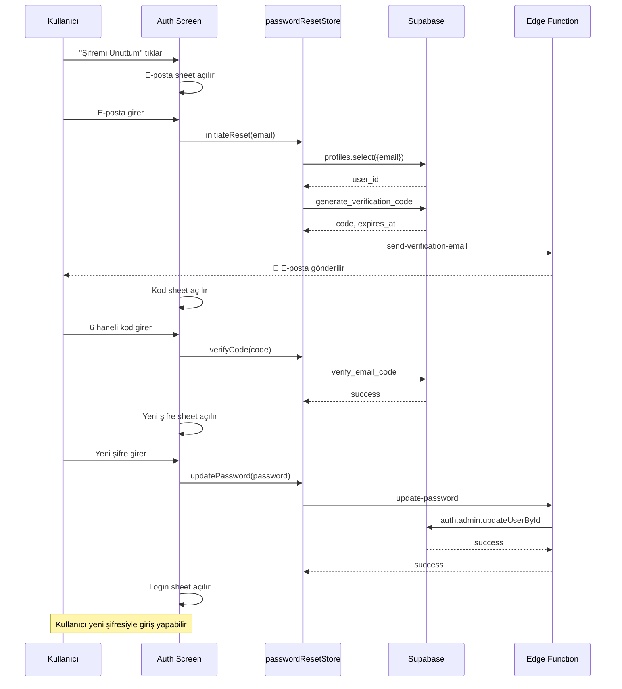

# Custom Password Reset Flow (6-Digit Code)

Mevcut 2FA altyapısını kullanarak özel şifre sıfırlama akışı:
1. Kullanıcı e-posta girer → 6 haneli kod gönderilir
2. Kodu doğrular → Yeni şifre sheet'i açılır
3. Yeni şifreyi kaydeder → Login ekranına döner

---

## Mevcut Altyapı

| Bileşen | Durum | Açıklama |
|---------|-------|----------|
| `email_verification_codes` tablosu | ✅ Hazır | `purpose = 'password_reset'` destekliyor |
| `generate_verification_code` RPC | ✅ Hazır | `p_purpose` parametresi var |
| `verify_email_code` RPC | ✅ Hazır | `p_purpose` parametresi var |
| `send-verification-email` Edge Function | ⚠️ Güncellenmeli | Password reset şablonu eklenmeli |
| `twoFactorService.ts` | ✅ Hazır | `VerificationPurpose = 'password_reset'` tanımlı |

---

## Yapılacaklar

### 1. `passwordResetStore.ts` (YENİ)

```typescript
interface PasswordResetState {
  email: string;
  userId: string | null;
  isPending: boolean;
  isVerified: boolean;
  isLoading: boolean;
  expiresAt: Date | null;
  timeRemaining: string;
  
  // Actions
  initiateReset: (email: string) => Promise<boolean>;
  verifyCode: (code: string) => Promise<{ success: boolean; error?: string }>;
  updatePassword: (newPassword: string) => Promise<{ success: boolean; error?: string }>;
  reset: () => void;
}
```

### 2. Edge Function Güncelleme

`send-verification-email/index.ts`:
- Request body'ye `purpose?: 'two_factor' | 'password_reset'` ekle
- Password reset için farklı e-posta şablonu:
  - Başlık: "Şifre Sıfırlama"
  - Mesaj: "Şifrenizi sıfırlamak için aşağıdaki kodu kullanın"

### 3. Auth Ekranı Değişiklikleri

`app/(auth)/index.tsx`:

**Aşama 1 - E-posta Girişi:** Mevcut sheet (değişiklik yok)

**Aşama 2 - Kod Doğrulama (YENİ):**
- 6 haneli input (2FA tasarımı)
- Kalan süre göstergesi
- Tekrar gönder butonu

**Aşama 3 - Yeni Şifre (YENİ):**
- Yeni şifre + onay inputları
- Password strength validasyonu
- Kaydet butonu

### 4. Şifre Güncelleme için Edge Function

Supabase `auth.admin.updateUserById` yalnızca service_role ile çalışır. Edge function oluşturulmalı:

```typescript
// supabase/functions/update-password/index.ts
Deno.serve(async (req) => {
  const { userId, newPassword } = await req.json();
  
  const supabaseAdmin = createClient(
    Deno.env.get('SUPABASE_URL')!,
    Deno.env.get('SUPABASE_SERVICE_ROLE_KEY')!
  );
  
  const { error } = await supabaseAdmin.auth.admin.updateUserById(
    userId,
    { password: newPassword }
  );
  
  return new Response(JSON.stringify({ success: !error }));
});
```

### 5. Çeviriler

```json
{
  "auth": {
    "resetPasswordCodeSent": "Doğrulama kodu e-posta adresinize gönderildi",
    "enterResetCode": "Doğrulama kodunu girin",
    "newPassword": "Yeni Şifre",
    "confirmNewPassword": "Yeni Şifre Onay",
    "passwordMismatch": "Şifreler eşleşmiyor",
    "passwordUpdated": "Şifreniz başarıyla güncellendi"
  }
}
```

---

## Akış Diyagramı



---

## Test Adımları

1. ✅ Auth ekranında "Şifremi Unuttum" tıkla
2. ✅ Kayıtlı e-posta gir ve gönder
3. ✅ E-postada 6 haneli kodu kontrol et
4. ✅ Kodu gir ve doğrula
5. ✅ Yeni şifre ekranının açıldığını doğrula
6. ✅ Yeni şifre gir ve kaydet
7. ✅ Başarı mesajı sonrası login ekranına dön
8. ✅ Yeni şifre ile giriş yap
